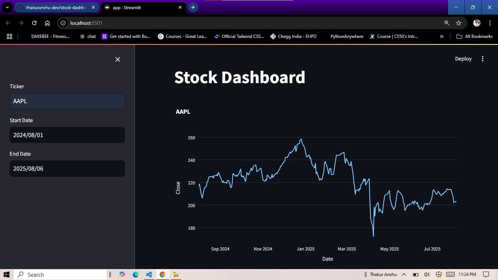
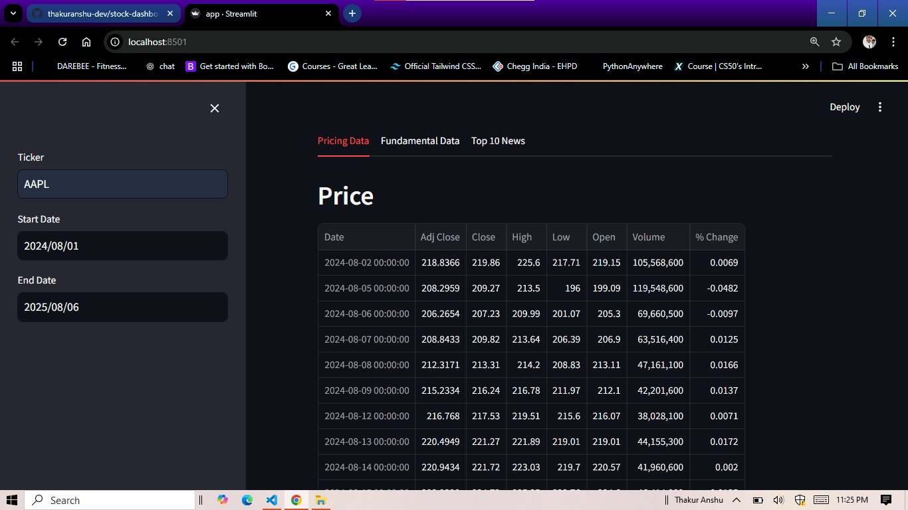
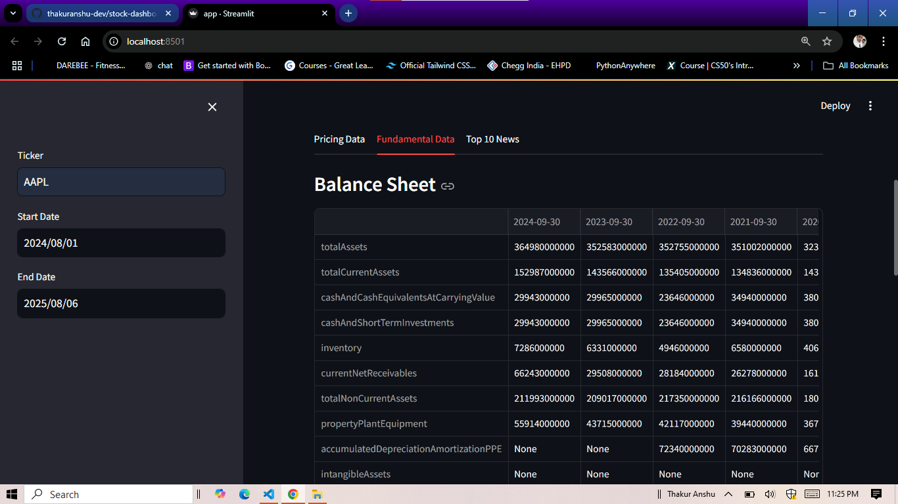
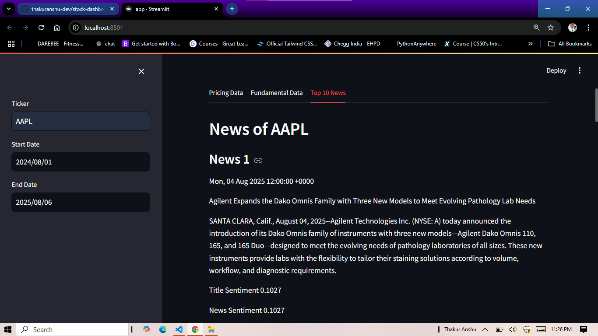

# Stock Dashboard App

A Streamlit-based web application for visualizing stock data, fundamental financials, and news for any publicly traded company.

## Features

- **Interactive Stock Price Chart:**  
  Visualize historical stock prices using Plotly.

- **Pricing Data Tab:**  
  View daily price changes, annual return, standard deviation, and risk-adjusted return.

- **Fundamental Data Tab:**  
  Display balance sheet, income statement, and cash flow statement using Alpha Vantage API.

- **Top 10 News Tab:**  
  Fetch and display the latest news headlines and sentiment for the selected ticker.

## Requirements

- Python 3.7+
- See `requirements.txt` for all dependencies:
  - streamlit
  - pandas
  - numpy
  - yfinance
  - plotly
  - python-dotenv
  - alpha_vantage
  - stocknews

## Setup

1. **Clone the repository:**
   ```sh
   git clone https://github.com/thakuranshu-dev/stock-dashboard.git
   ```

2. **Install dependencies:**
   ```sh
   pip install -r requirements.txt
   ```

3. **Set up Alpha Vantage API key:**
   - Create a `.env` file in the project directory.
   - [Get your free alpha vantage api key from here](https://www.alphavantage.co/support/#api-key)
   - Add your API key:
     ```
     API_KEY=your_alpha_vantage_api_key
     ```

## Usage

1. **Run the Streamlit app:**
   ```sh
   streamlit run app.py
   ```

   or you may need to hit:
   ```sh
   python -m streamlit run app.py
   ```

2. **In the sidebar:**
   - Enter a stock ticker (e.g., MSFT, AAPL).
   - Select start and end dates.

3. **Explore the tabs:**
   - **Pricing Data:** Price table and statistics.
   - **Fundamental Data:** Financial statements.
   - **Top 10 News:** Latest news and sentiment.

## Screenshots






## Notes

- The app uses [yfinance](https://github.com/ranaroussi/yfinance) for historical price data.
- Financial statements require a valid [Alpha Vantage API key](https://www.alphavantage.co/support/#api-key).
- News headlines are fetched using the [stocknews](https://pypi.org/project/stocknews/) package.

## License

[MIT LICENSE](LICENSE)

---
